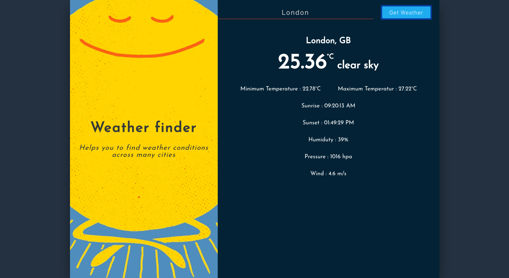

# Weather App

This Weather web app made with ReactJS.

## Project Overview

Weather web app is very simple to use, just write the city name in the text field and hit *get weather* button and it will show the current weather. It uses *Open Weather* API under the hood to fetch weather information.

[Live Demo](https://weather-app-8827.firebaseapp.com/)

<p>
    
</p>

## Instruction

1 Clone this repository to your local machine.

```
$ git clone <URL>
```

2 Goto [Open Weather API](https://openweathermap.org/api) website to get your ```Secret Key```.

3 Create ```.env``` file in the root directory of this project.

4 In ```.env``` file write following line

```
REACT_APP_APIKEY = <Your Open Weather Secret Key>
```

5 To start the app write following command in terminal and hit enter.

```
$ npm install
$ npm start
```

6 Now visit [http://localhost:3000/]() in your browser

7 That's it. Enjoy the weather of your favorite city.
